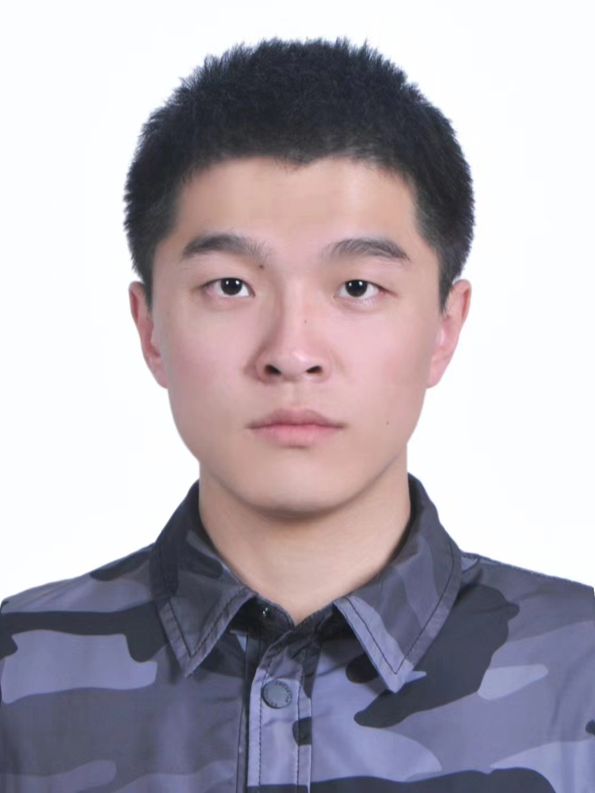

---
# An instance of the Contact widget.
# Documentation: https://wowchemy.com/docs/page-builder/
widget: contact

# This file represents a page section.
headless: true

# Order that this section appears on the page.
weight: 10

title:
subtitle:

design:
  columns: '1'
---

### Group Members

#### Doctoral students

---

|                                                              |                                                              |
| :----------------------------------------------------------- | :----------------------------------------------------------- |
|  | **2020-Present, Zezheng Ding: Deep Learning for seismic imaging and inversion** Jiaxing Sun graduated from China University of Petroleum (Beijing) with a master’s degree in Geoscience in June 2020. She joined the China University of Petroleum (East China) in September 2020 and started pursuing Ph.D. Her current work mainly focused on using the deep learning for seismic AVO inversion, least-squares migration, diffraction/reflection separation and wavefield separation. In her free time, she loves outdoor activities such as climbing。 |

#### Master students

---

       

### Openings

We are looking for qualified students with strong motivation on seismology and geophysics. Please feel free to contact Dr. Yingming Qu ([yingming.qu@upc.edu.cn](mailto:yingming.qu@upc.edu.cn)) if you have any questions about master and doctoral application at China University of Petroleum.